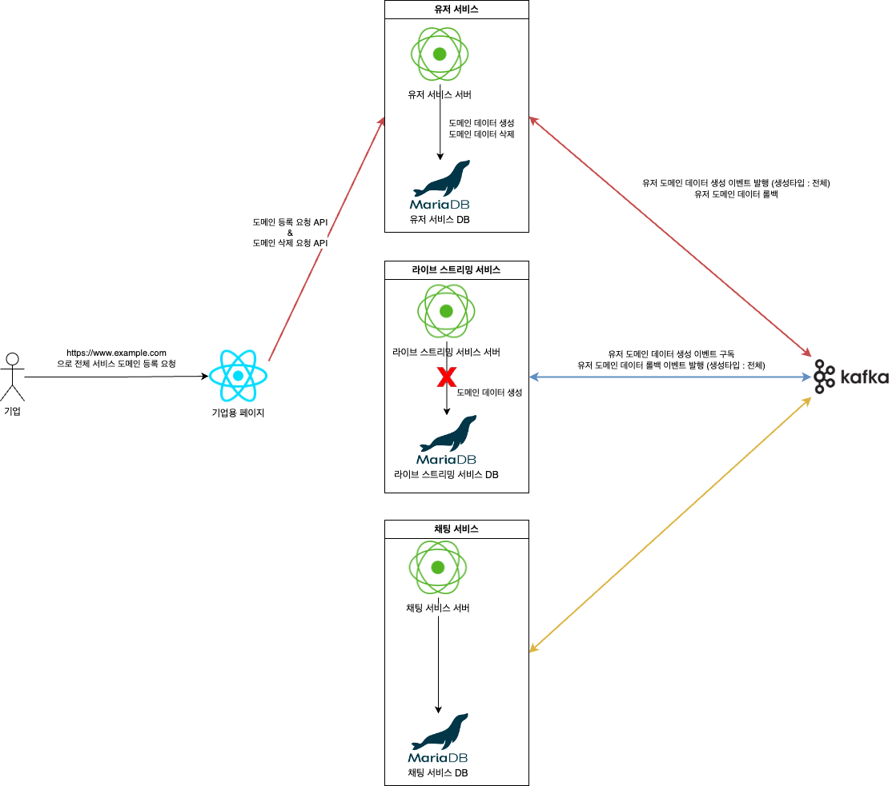

# SaaS 권한 인증 서버

## Domain & API Key 기반 Multi-Tenancy

API Request에서 다음 2가지를 가지고 권한을 인증합니다.

1. Request Client의 도메인 - {Protocol}://{Domain}{Uri}
2. Request Header의 api-key 값

이런 권한 인증을 Monolithic, MSA 각 환경에서 구현합니다. [캡스톤디자인 재설계](https://velog.io/@long9725/%EC%BA%A1%EC%8A%A4%ED%86%A4%EB%94%94%EC%9E%90%EC%9D%B8-%EB%A6%AC%ED%8C%A9%ED%86%A0%EB%A7%811-MSA-%EA%B8%B0%EB%B0%98-%EC%9E%AC%EC%84%A4%EA%B3%84#monolithic-%ED%99%98%EA%B2%BD%EC%97%90%EC%84%9C%EC%9D%98-db) 포스팅에서 자세한 내용을 확인할 수 있습니다.

## 목표

1. Monolithic 환경에서 Spring Security 활용해서 도메인 & API Key 인증 시스템 도입
2. 유저 / 라이브 스트리밍 / 채팅 서비스를 분리
3. React 같은 클라이언트 쪽에서 보상 트랜잭션 처리해보기
4. Kafka 도입해서 Saga 패턴 적용

## 환경

+ amazoncorretto JDK 21
+ Spring boot 3.2.1
+ Spring MVC & JPA
+ PostgreSQL

JDK 21 & Spring boot 3.2.x는 Virtual Thread도 사용해보고자 선택했습니다. PostgreSQL 또한 평소에 사용해보고 싶었기에 선택했습니다.

## Monolithic

monolithic 폴더에서 확인할 수 있습니다.

## MSA

* user - 사용자와 관련된 서비스의 권한을 확인합니다. 
* chat - 채팅 서비스의 권한을 확인합니다.
* live - 라이브 스트리밍 서비스의 권한을 확인합니다.
