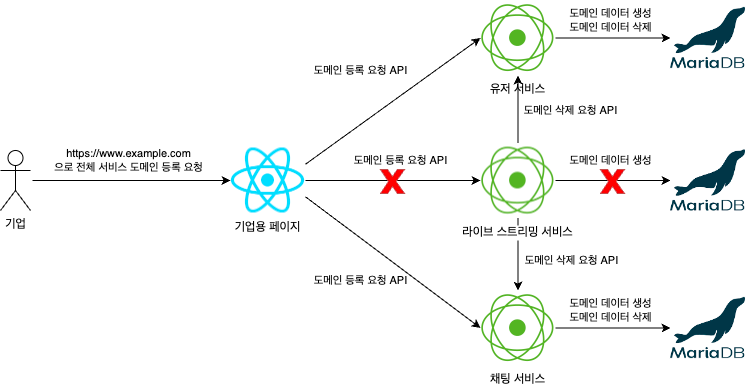

# Monolithic
Monolithic 환경에서 Spring Security 활용해서 도메인 & API Key 인증 시스템 도입합니다.

## 환경



+ amazoncorretto JDK 21
+ Spring boot 3.2.1
+ Spring MVC & JPA
+ PostgreSQL

JDK 21 & Spring boot 3.2.x는 Virtual Thread도 사용해보고자 선택했습니다. PostgreSQL 또한 평소에 사용해보고 싶었기에 선택했습니다.

## Quick Start

### IDEA Environment variables
```shell
MONOLITHIC_SERVER_PORT=8081;POSTGRES_DB=pg_db;POSTGRES_IP=127.0.0.1;POSTGRES_PASSWORD=pg_password;POSTGRES_PORT=5433;POSTGRES_USER=user;REDIS_PORT=6380
```

### Docker-compose env
```dotenv
POSTGRES_PORT=5433
POSTGRES_DB=pg_db
POSTGRES_USER=user
POSTGRES_PASSWORD=pg_password
REDIS_PORT=6380
MONOLITHIC_SERVER_PORT=8081
PGADMIN_PORT=5050
PGADMIN_DEFAULT_EMAIL=pgadmin_default_email@email.com
PGADMIN_DEFAULT_PASSWORD=pgadmin_default_password
```

### Run
ENV 파일 설정을 했다면 다음 명령어를 실행합니다.

```shell
docker build -t monolithic-server .
docker-compose up -d
```